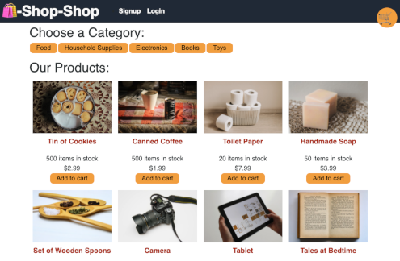
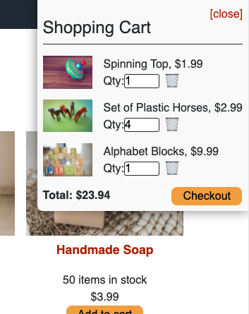
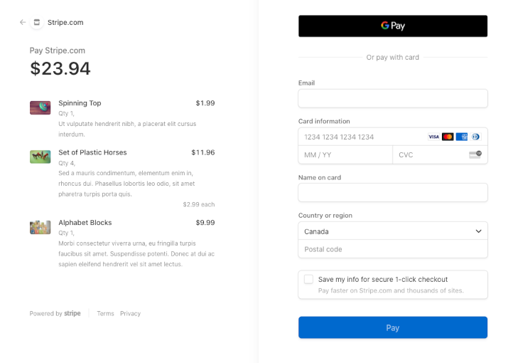

# Redux-Shop
 
                        

## Description
An E-Commerce platform written with React.js framework using Global State provided through Redux and connected with Apollo/GraphQl to a MongoDB backend. 
Login, Shop for products, then Checkout in style thanks to the Stripe payment API.

Demo Site: https://qcent-e-shoppe.herokuapp.com/

## Table of Contents

* [Description](#description)
* [Table of Contents](#table-of-contents)
* [Usage](#usage)
* [Questions](#questions)
* [License](#license)

## Usage

Navigate to the [Site](https://qcent-e-shoppe.herokuapp.com/) and be greeted by this wonderful sight. 

Click on the products of your fancy and add them to your cart. Adjust the quantities if you wish from the Shopping cart sidebar, or Trash any items you are not interested in.

Once you've found all you came for, make sure you have logged in before checking out! Then just click the Checkout button from the shopping cart and you'll be taken to our third party affiliate Stripe.com to complete the payment process.

## Questions

[GitHub: Qcent](https://github.com/Qcent)  
dquinn8@cogeco.ca

   
## License

MIT License

Copyright (c) 2022 Dave Quinn

Permission is hereby granted, free of charge, to any person obtaining a copy
of this software and associated documentation files (the "Software"), to deal
in the Software without restriction, including without limitation the rights
to use, copy, modify, merge, publish, distribute, sublicense, and/or sell
copies of the Software, and to permit persons to whom the Software is
furnished to do so, subject to the following conditions:

The above copyright notice and this permission notice shall be included in all
copies or substantial portions of the Software.

THE SOFTWARE IS PROVIDED "AS IS", WITHOUT WARRANTY OF ANY KIND, EXPRESS OR
IMPLIED, INCLUDING BUT NOT LIMITED TO THE WARRANTIES OF MERCHANTABILITY,
FITNESS FOR A PARTICULAR PURPOSE AND NONINFRINGEMENT. IN NO EVENT SHALL THE
AUTHORS OR COPYRIGHT HOLDERS BE LIABLE FOR ANY CLAIM, DAMAGES OR OTHER
LIABILITY, WHETHER IN AN ACTION OF CONTRACT, TORT OR OTHERWISE, ARISING FROM,
OUT OF OR IN CONNECTION WITH THE SOFTWARE OR THE USE OR OTHER DEALINGS IN THE
SOFTWARE.